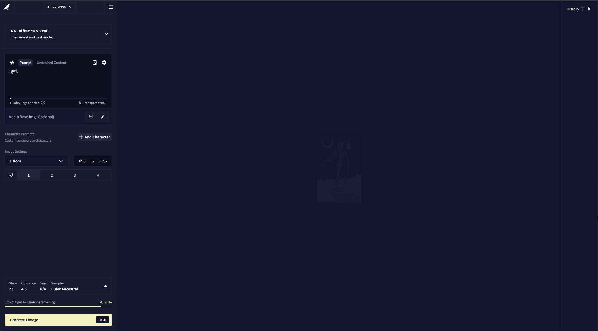

# TarotNAI

A self-hosted web front-end for NovelAI image generation that restores the old classic NovelAI image generation UI. You run it on your own
machine, it talks to NovelAI with your own API key, and the images stay on your
disk.

It's like totally cool yo, and the NAI in the title stands for NotAI, btw. Any resemblance to the abbreviation of a popular image service is pure coincidence. 

# This project is not affiliated with NovelAI. Any bugs experienced while using the UI should not be reported to NAI but instead to [issues](https://github.com/TarotFooling/TarotNAI/issues). I will perform voodoo on you if you bother the NAI team about this. 



## Important
### This UI is currently in **BETA**, it will have bugs and it will be missing something niche. It already has some important difficult features like focused inpainting, and canvases.
However the following is missing
- Director Tools
- Live preview as images generate
- Tokenizer
- Perfect mobile mode (It works, but sometimes weird)
- Theme Customization 
- 3D model support (never getting added to this UI)

## Requirements

- [Node.js](https://nodejs.org) 22 or newer
- A NovelAI subscription (preferably opus) with a persistent API token

## Setup

```
git clone <this repo>
cd tarotnai
npm install
```

Copy `.env.example` to `.env` and set your key:

```
NAI_KEY=pst-your-token-here
```

Get the token from NovelAI under **User Settings → Account → Get Persistent API
Token**.

## Running

```
npm start
```

Or use the launcher, which installs dependencies and creates `.env` for you on
the first run - `start.bat` on Windows, `./start.sh` on macOS and Linux.

Then open <http://localhost:8744>.

## Sign-in

The app is yours alone... By default it binds to `127.0.0.1`, so only your own
machine can reach it and there is no sign-in screen at all.

If you want to reach it from another device on your own network, set
`HOST=0.0.0.0` and give it a password so nothing else can use your key:

```
HOST=0.0.0.0
APP_PASSWORD=something-quriky
```

You can sign in with your own Discord account instead of a password. It is off
by default, and `DISCORD_USER_ID` is the single account allowed in - yours:

```
OAUTH_ENABLED=true
DISCORD_CLIENT_ID=...
DISCORD_CLIENT_SECRET=...
DISCORD_USER_ID=your-own-id
```


## Configuration

Everything is optional except `NAI_KEY`. See `.env.example` for the full list
with comments.

| Variable | Default | What it does |
| --- | --- | --- |
| `NAI_KEY` | - | Your NovelAI persistent API token |
| `PORT` | `8744` | Port to listen on |
| `HOST` | `127.0.0.1` | Interface to bind; `0.0.0.0` exposes it |
| `APP_PASSWORD` | - | Set to require a password |
| `OAUTH_ENABLED` | `false` | Sign in with your own Discord account |
| `DISCORD_USER_ID` | - | Your Discord ID, when OAuth is on |
| `IMAGES_DIR` | `images` | Where generated images are archived |
| `LOG_REQUESTS` | `true` | Log each NovelAI request to a LOCAL folder |

## Notes

Look pal, this is not for automation. There is no queuing, no multi-key, no auto-generate. I will not be adding those features as they are against NAI's TOS. Kay? 
